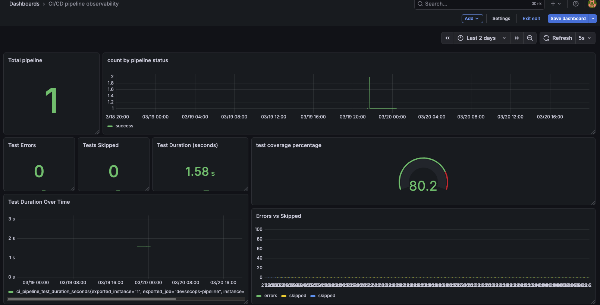

# CI/CD Observability avec Prometheus et Grafana

## 1. Objectif

L’objectif de cette configuration est de **monitorer ton pipeline CI/CD** pour :

- Savoir **le statut global du pipeline** (succès, échec, annulé)
- Suivre **le statut de chaque job** individuellement
- Collecter des métriques pour visualisation et alerting
- Maintenir une **traçabilité** des exécutions

L’avantage : détecter rapidement les problèmes, améliorer la qualité et la fiabilité de tes déploiements.

---

## 2. Outils/Stack utilisés

| Outil | Rôle |
| --- | --- |
| **GitHub Actions** | Exécute le pipeline CI/CD |
| **Python script (`observability_metrics.py`)** | Génère des métriques Prometheus à partir des résultats des jobs |
| **Prometheus** | Collecte les métriques exposées par Pushgateway donc prometheus fera un pull (en appellant l'endpoint exposé par pushgateway) et il les stocke dans sa base de données de séries chronologiques. (time-series database) |
| **Pushgateway** | Prometheus Pushgateway a pour but de permettre aux tâches éphémères et aux tâches par lots de transmettre leurs métriques à Prometheus.
. Ici il Permet à GitHub Actions d’envoyer des métriques sous format fichier .prom (Prometheus text format). Il expose /metrics comme les autre exporters et prometheus fera la requête pour recupérer les métriques |
| **Grafana** | Visualise les métriques stocké dans prometheus et crée des dashboards |

---

## 3. Architecture

```
GitHub Actions CI/CD
       │
       ▼
observability_metrics.py → observability.prom
       │
       ▼
   Pushgateway
       │
       ▼
   Prometheus scrape
       │
       ▼
     Grafana dashboard
```

---

## 4. Setup Docker Compose

Crée un fichier `docker-compose.yml` :

```
version:"3.8"

services:
  prometheus:
    image: prom/prometheus:latest
    container_name: prometheus
    ports:
      -"9090:9090"
    volumes:
      - ./prometheus.yml:/etc/prometheus/prometheus.yml
      - ./data/prometheus:/prometheus
    restart: unless-stopped

  pushgateway:
    image: prom/pushgateway:latest
    container_name: pushgateway
    ports:
      -"9091:9091"
    restart: unless-stopped

  grafana:
    image: grafana/grafana:latest
    container_name: grafana
    ports:
      -"3000:3000"
    volumes:
      - ./data/grafana:/var/lib/grafana
    restart: unless-stopped
```

---

## 5. Configuration Prometheus

Crée `prometheus.yml` :

```
global:
  scrape_interval: 5s

scrape_configs:
  - job_name:"prometheus"
    static_configs:
      - targets: ["localhost:9090"]

  - job_name:"pushgateway"
    static_configs:
      - targets: ["pushgateway:9091"]
```

---

## 6. Lancer le stack

```
docker-compose up-d
```

- Prometheus : http://localhost:9090
- Grafana : http://localhost:3000 (admin/admin)

---

## 7. GitHub Actions – Observability

Dans ton job `observability`, expose **les statuts globaux et individuels** :

```
env:
    BUILD_STATUS: ${{ needs.build.result }}
    SCA_SAST_STATUS: ${{ needs.security_checks_sca_sast.result }}
    TEST_STATUS: ${{ needs.test.result }}
    DAST_STATUS: ${{ needs.security_checks_dast.result }}
    CI_PIPELINE_STATUS: ${{ 
    contains(needs.*.result, 'failure') && 'failure' ||
    contains(needs.*.result, 'cancelled') && 'cancelled' ||
    'success' }}
    CI_PIPELINE_VERSION: ${{ github.ref_name }}
    GITHUB_RUN_ID: ${{ github.run_id }}
    GITHUB_RUN_NUMBER: ${{ github.run_number }}
    GITHUB_RUN_ATTEMPT: ${{ github.run_attempt }}
    GITHUB_JOB: ${{ github.job }}
    GITHUB_WORKFLOW: ${{ github.workflow }}
    GITHUB_REF: ${{ github.ref }}
    GITHUB_REF_NAME: ${{ github.ref_name }}
    GITHUB_SHA: ${{ github.sha }}
    GITHUB_REPOSITORY: ${{ github.repository }}
    GITHUB_ACTOR: ${{ github.actor }}
    GITHUB_EVENT_NAME: ${{ github.event_name }}
```

Puis **push des métriques** :

en local pour faire des tests, remplacer PUSHGATEWAY_URL par http://localhost:9091
```
curl-X POST--data-binary @observability.prom \
"$PUSHGATEWAY_URL/metrics/job/devsecops-pipeline/instance/${GITHUB_RUN_ID}"
```

---

## 8. Python script

On Génère un fichier .prom qui contient des métriques Prometheus produites à des résultats des jobs (build, tests, analyse vulnérabilités)

ex: 
on doit avoir en amont les fichiers pytest et coverage

python .github/scripts/observability_metrics.py \
            --junit artifacts/pytest-results.xml \
            --coverage artifacts/coverage.xml \
            --out observability.prom

---

## 9. Exemple de métriques Prometheus

```
# HELP ci_pipeline_info Informations définissant le pipeline GH Actions
# TYPE ci_pipeline_info gauge
ci_pipeline_info{run_id="23314489843",run_number="23",run_attempt="1",workflow="Python application",job="observability",repository="Alexon1999/devsecops-pipeline",ref="refs/heads/main",ref_name="main",sha="e013f3e2770c784a991a87d5b9fb33147413a6a0",actor="Alexon1999",event_name="push",version="main",status="success",build_status="success",sca_sast_status="success",test_status="success",dast_status="success"} 1
# HELP ci_pipeline_status Statut détaillé du pipeline
# TYPE ci_pipeline_status gauge
ci_pipeline_status{status="success"} 1
# HELP ci_pipeline_test_total nombre total de tests exécutés
# TYPE ci_pipeline_test_total gauge
ci_pipeline_test_total 2
# HELP ci_pipeline_test_failures nombre de tests échoués
# TYPE ci_pipeline_test_failures gauge
ci_pipeline_test_failures 0
# HELP ci_pipeline_test_errors nombre de tests en erreur
# TYPE ci_pipeline_test_errors gauge
ci_pipeline_test_errors 0
# HELP ci_pipeline_test_skipped nombre de tests sautés
# TYPE ci_pipeline_test_skipped gauge
ci_pipeline_test_skipped 0
# HELP ci_pipeline_test_duration_seconds durée totale des tests en secondes
# TYPE ci_pipeline_test_duration_seconds gauge
ci_pipeline_test_duration_seconds 1.583
# HELP ci_pipeline_coverage_line_rate taux de couverture des lignes (0..1)
# TYPE ci_pipeline_coverage_line_rate gauge
ci_pipeline_coverage_line_rate 0.8018
# HELP ci_pipeline_coverage_branch_rate taux de couverture des branches (0..1)
# TYPE ci_pipeline_coverage_branch_rate gauge
ci_pipeline_coverage_branch_rate 0.0
# HELP ci_pipeline_coverage_statements nombre total de statements analysés
# TYPE ci_pipeline_coverage_statements gauge
ci_pipeline_coverage_statements 111
# HELP ci_pipeline_coverage_missed nombre de statements manquants
# TYPE ci_pipeline_coverage_missed gauge
ci_pipeline_coverage_missed 22
# HELP ci_pipeline_coverage_percent pourcentage de couverture des statements (0-100)
# TYPE ci_pipeline_coverage_percent gauge
ci_pipeline_coverage_percent 80.17999999999999
# HELP ci_pipeline_stage_status Statut des étapes principales du pipeline
# TYPE ci_pipeline_stage_status gauge
ci_pipeline_stage_status{stage="build",status="success"} 1
ci_pipeline_stage_status{stage="sca_sast",status="success"} 1
ci_pipeline_stage_status{stage="test",status="success"} 1
ci_pipeline_stage_status{stage="dast",status="success"} 1
ci_pipeline_stage_status{stage="ci",status="success"} 1
```

- `1` = success, `0` = failure

---

## 10. Visualisation Grafana

1. Ajouter une **data source** : Prometheus (`http://prometheus:9090`)
2. Créer un dashboard avec panels :

| Panel | Requête Prometheus | Type |
| --- | --- | --- |
| Statut global pipeline | `ci_pipeline_status` | Stat |
| Statut par job | `ci_job_status` | Gauge |
| Taux de réussite | `sum(ci_job_status)/count(ci_job_status)` | Graph |


exemple :




---

## 11. Test E2E du setup

1. Lancer le stack Docker Compose :

**le serveur prometheus pushgateway doit être accessible par runner github actions**

```
docker-compose up-d
```

1. Exécuter un pipeline GitHub Actions avec le job `observability`
2. Vérifier dans Pushgateway que les métriques sont présentes :
    
    http://localhost:9091/
    http://localhost:9091/metrics
    
3. Aller sur Grafana et importer les métriques

---

## 12. Intérêt d’Observability pour un pipeline CI/CD

- ✅ **Traçabilité** : garder l’historique des pipelines
- ✅ **Alerting** : Grafana + Alertmanager peuvent prévenir immédiatement les équipes
- ✅ **Amélioration continue** : identifier les étapes les plus instables
- ✅ **Reporting** : dashboards pour management et DevOps